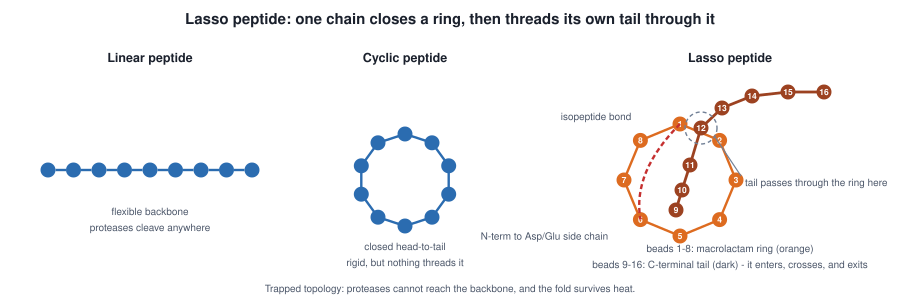

# PRP49 论文插图集（10 张，第二版）

> 图 1–7 为 SVG（矢量，可编辑）；图 8–10 为 PNG（matplotlib，200 dpi）。
> 每张图给出**论文中的使用位置**。

## 本次修改记录（依据你的审阅意见）

| 图 | 你指出的问题 | 处理 |
|---|---|---|
| 1 | Lasso 肽结构表示不清，看不出同一条链成环、尾巴穿过自身 | **重画**：改为一条连续的珠子链（环珠 1–8 + 尾珠 9–16），尾部在珠 1–2 之间穿过环并标出穿线点；异肽键明确指出是 N 端↔Asp/Glu 侧链 |
| 3 | 图注与图相互遮挡 | legend 移到坐标轴下方；**并额外发现一个我自己的 bug**——分组标签与人/细菌两半**完全颠倒**，已修复（人源移到上半） |
| 7 | 图注与图相互遮挡 | legend 移除；右图改为**同协议对比**（路线 A 只在家族分组下测过，原先并排两组会造成误读）|
| 9 | （复核时发现）多样性约束的标注**语义写反** | 由"−33 kept as eligible pool"改为"−33 removed by the diversity cap" |
| 10 | （复核时发现）按分数排序使稳健性颜色穿插，难读 | 改为**按稳健性分组排序**，组间加分隔线 |

> 复核方式：把 SVG 栅格化后逐张目视核对，并对 matplotlib 图检查 legend 位置与分组标签。
> 图 3 与图 9 的错误都是这次复核才发现的，并非你指出 —— 说明单看图注不够，必须看图本身。

---

## 图 1 · Lasso 肽拓扑（**已重画**）

**一条连续的珠子链**：珠子 1–8 闭合成大环（橙色），珠子 9–16 是 C 端尾部（深褐色）。尾部从环内（珠 9–11）向上，在珠 1 与珠 2 之间**穿过环**（虚线圆圈标出穿线点），再从环外延伸出去（珠 13–16）。异肽键用红色虚线连接珠 1（N 端 α-氨基）与珠 6（Asp/Glu 侧链羧基），并注明是 **N 端↔侧链**而非头尾成环。用于**绪论 1.1–1.2**。

---

## 图 2 · Lasso 肽的生物合成

前体肽 → lasso cyclase 闭环 → C 端尾部穿环 → 成熟 Lasso 肽。用于**绪论 1.1**。

---

## 图 3 · 已表征 Lasso 肽的靶点谱（**已修正**）

**上半为人源靶点**（RES-701-3/1×ETB、Anantin×NPR1、BI-32169×GCGR），**下半为细菌靶点**（MccJ25/Capistruin×RNAP、Lassomycin×ClpC1、Lariocidin×30S 等），按证据等级着色，并新增**证据来源列**（9KDF、IC50 10 nM、6N60、8IBO…）。用于**绪论 1.2**，支撑"Lasso 肽已可作用于人源靶点"。

---

## 图 4 · 通用结构预测工具的失效与 LassoPred 的解决

左：AlphaFold2/3、ESMFold 因套索结与异肽键失败；右：LassoPred 的两段式流程，结构覆盖从 <50 条扩展到 4,749 条。用于**绪论 1.3**。

---

## 图 5 · 本项目技术路线总览

八步流程。用于**方法总览**。

---

## 图 6 · 双编码器双线性注意力架构（**已修正**）

靶序列 → ESM-2(35M)、肽序列 → LassoESM(650M)，BAN 融合后**并联**输出分类头与回归头。用于**方法 3.1**。

---

## 图 7 · 正样本稀缺与家族同源扩增（**已重画**）

左：正样本 352 → 759；右：**同一协议、同一折划分**下的对比 —— 家族分组基线 0.8142 vs 加传播 0.7481（−0.066），说明扩增未带来提升。用于**方法 3.2 + 讨论**。

---

## 图 8 · 四档验证协议阶梯（核心方法学图）

同一模型族在五种协议下的表现，带折间标准差。用于**结果 4.1**。

---

## 图 9 · 候选筛选漏斗 650 → 43 → 10（**已修正**）

标注每级排除的数量与理由；多样性约束的 −33 已改为正确表述（"removed by the diversity cap，保留在审计表中作为备选"）。用于**结果 4.3**。

---

## 图 10 · 最终 10 对候选（**已重排**）

**按稳健性分组排序**：4 对在全部 5 种权重下入选（橙）→ 4 对 4/5（蓝）→ 2 对 ≤3/5（红），组间有分隔线。用于**结果 4.3**。

---

## 仍待你确认

1. 图 1 的穿线表达现在是否清楚（珠子 9–12 在环内，12 穿出，13–16 在环外）
2. 图 3 的靶点清单与证据来源是否需要增删
3. 图 5 八步流程的顺序是否与实际一致
4. 配色/字号是否满足投稿要求（现为英文标注，中文说明在正文图注）

## 事实更正（延续上一版）

LassoPred 的合作方 **Vanderbilt University（范德堡大学）在美国田纳西州纳什维尔，不在德国**；
**LassoESM 是 UIUC + Vanderbilt（Mitchell 组）的工作**，本项目为**采纳**。绪论已按此表述。