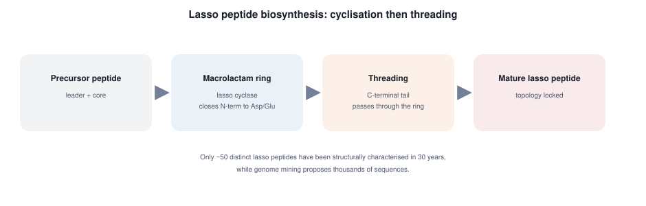
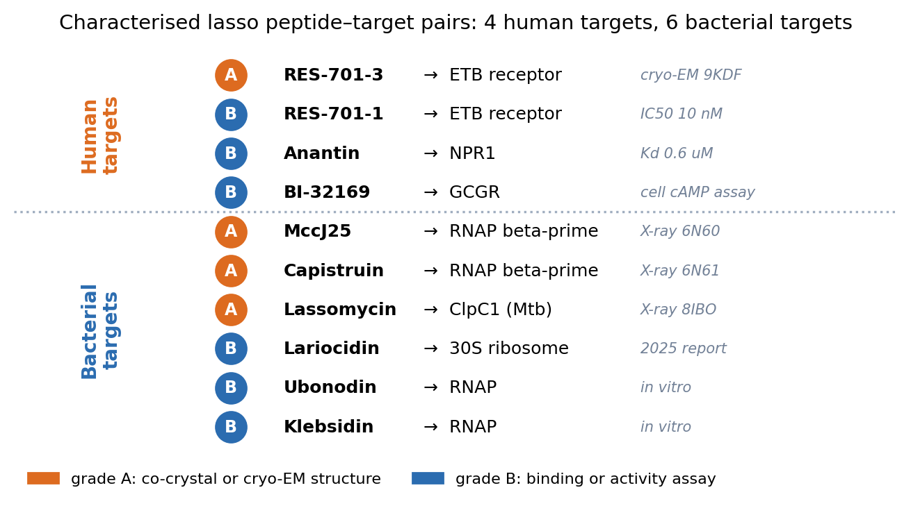
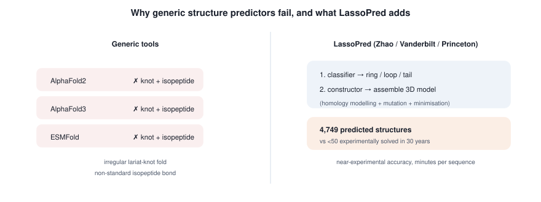
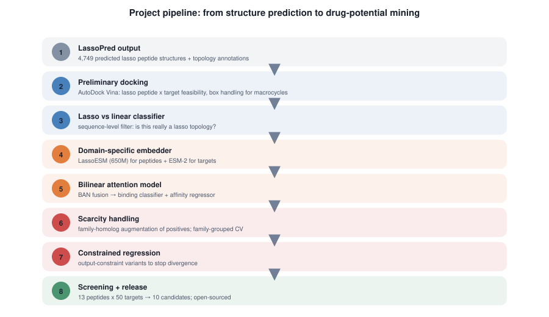
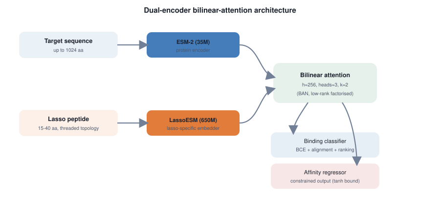
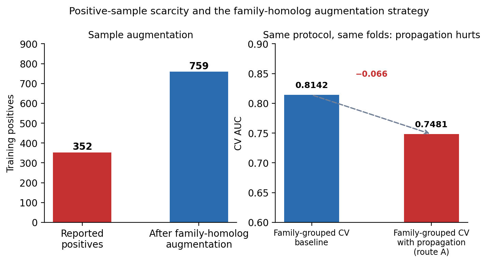
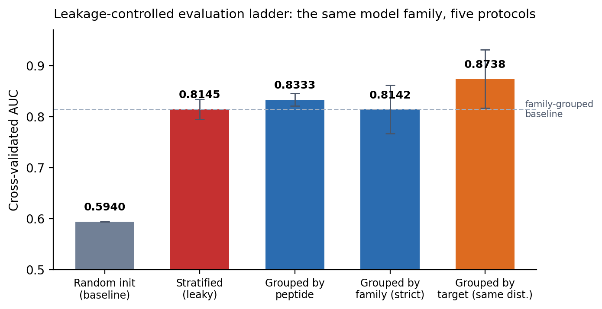
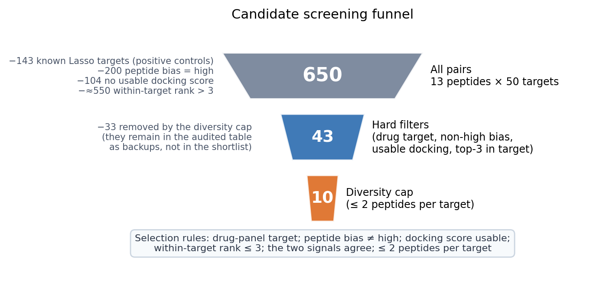
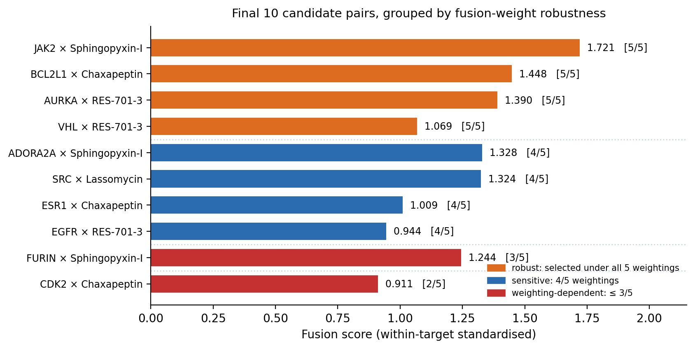

# PRP49 论文插图集（10 张，第二版）

> 图 1–7 为 SVG（矢量，可编辑）；图 8–10 为 PNG（matplotlib，200 dpi）。
> 每张图给出**论文中的使用位置**。

## 本次修改记录（依据你的审阅意见）

| 图 | 你指出的问题 | 处理 |
|---|---|---|
| 1 | Lasso 肽结构表示不清，看不出同一条链成环、尾巴穿过自身（**关键纠正**：应按套马索几何——绳端穿回自己形成的圈）| **重画**：改为一条连续的珠子链（环珠 1–8 + 尾珠 9–16），尾部在珠 1–2 之间穿过环并标出穿线点；异肽键明确指出是 N 端↔Asp/Glu 侧链 |
| 3 | 图注与图相互遮挡 | legend 移到坐标轴下方；**并额外发现一个我自己的 bug**——分组标签与人/细菌两半**完全颠倒**，已修复（人源移到上半） |
| 7 | 图注与图相互遮挡 | legend 移除；右图改为**同协议对比**（路线 A 只在家族分组下测过，原先并排两组会造成误读）|
| 9 | （复核时发现）多样性约束的标注**语义写反** | 由"−33 kept as eligible pool"改为"−33 removed by the diversity cap" |
| 10 | （复核时发现）按分数排序使稳健性颜色穿插，难读 | 改为**按稳健性分组排序**，组间加分隔线 |

> 复核方式：把 SVG 栅格化后逐张目视核对，并对 matplotlib 图检查 legend 位置与分组标签。
> 图 3 与图 9 的错误都是这次复核才发现的，并非你指出 —— 说明单看图注不够，必须看图本身。

---

## 图 1 · Lasso 肽拓扑（**第 8 版：沿链渐变配色**）

**配色方案（本版新增）**：三个面板统一采用**沿肽链方向、从 N 端到 C 端的渐变**
（viridis 色带：深紫 → 蓝 → 青 → 绿 → 黄），而非单一颜色。

| 要点 | 实现 |
|---|---|
| 渐变沿**链**方向 | 每条化学键用 SVG `linearGradient` 沿**自身方向**上色，因此渐变跟随链的走向，不随页面坐标 |
| 珠子取色 | 珠子颜色 = 色带(该残基在链上的归一化位置 t)，t=0 为 N 端、t=1 为 C 端 |
| 环肽的环化 | 闭合键从 t=0.9 跳回 t=0，**颜色突变正好标记"头尾相连"**这一事实 |
| Lasso 的连续性 | 环（深紫→绿）+ 尾部（绿→黄）渐变连续，一眼可看出**是同一条链** |
| 阅读方向 | 图下方给出色带图例（N-terminus → C-terminus）|
| 色带选择 | viridis：感知均匀且色盲友好；如需换成 plasma / 冷暖色系，改一行即可 |
| 残基编号 | **纯白色**（无描边），字号 8.5 加粗 |
| 色带范围 | 映射到 viridis **[0, 0.88]** 而非 [0, 1] —— 该色带顶端为极浅的黄色，纯白编号在其上不可读；收窄后仍保持完整渐变观感，而白字在**所有**珠子上均可读 |

**穿过关系的表达（本版关键修正）**：两处交叉必须具有**相反的遮挡方向**，否则读起来只是"尾部贴在环上"。

| 交叉 | 位置 | 所在键 | 遮挡方向 |
|---|---|---|---|
| (a) | 右上 (642, 182) | 珠 15→16 | **环遮挡尾部** |
| (b) | 左下 (558, 218) | 珠 18→19 | **尾部遮挡环** |

实现方式为**三层绘制**：尾部进入段（珠 9-15 及 15→16 键）→ **环** → 尾部穿出段（珠 16-20 及 18→19 键）。
分层切点**由交叉点所在的键自动推出**（`SPLIT = own[0] + 1`），不硬编码，便于后续调整轨迹。

> **修正前的隐蔽缺陷**：早期版本的交叉点距最近环珠子仅 4–5 px —— 珠子是**实心圆盘**，
> 会把交叉点整个盖住，使环的**线条**无法参与遮挡，于是两处交叉看起来一样（都是"尾在环后"）。
> 现用几何计算把交叉点置于**环珠子之间的角度中点**（−22.5° 与其对径点 157.5°），
> 交叉点距最近环珠 **17.9 px**，线对线的遮挡清晰可见。

**几何（沿用 v7，断言仍全部通过）**：
8→9 键长 37 px · 尾部/环最小间距 16 px · 环孔内珠子 3 个（16-18）· 与圆周交点恰 2 个。

**拓扑要点（v7 起固定）**：珠 8 与珠 9 以正常肽键相连，链未断开；尾部**先离开环**（珠 9-12 越顶），
**再折返**（13-15）并**穿过环孔**（16-18 在孔内，19-20 穿出）；交叉处**由环遮挡尾部**以表达"穿过"。

**迭代记录（8 版）**：

| 版本 | 问题 |
|---|---|
| v1 | 环与尾画成两个独立物体 |
| v2 | 尾部线条穿过面板标题 |
| v3 | 漏画环肽面板连线 |
| v4 | 尾部从环上缘冒出（仍是"环上挂一条尾巴"）|
| v5 | 斜穿但 8-9 断开、双色区分环/尾、遮挡方向画反 |
| v6 | 拓扑对但布局溢出画布 |
| v7 | 布局修复，但**单一颜色导致层次不清** |
| v8 | 沿链渐变配色，但两处交叉遮挡方向相同 |
| v9 | 编号改纯白、收窄色带（黄底白字不可读）|
| **v11** | ✅ 三层绘制，两处交叉**遮挡相反**；交叉点移到珠子之间 |

**用途**：绪论 1.1–1.2。

## 图 2 · Lasso 肽的生物合成

前体肽 → lasso cyclase 闭环 → C 端尾部穿环 → 成熟 Lasso 肽。用于**绪论 1.1**。

---

## 图 3 · 已表征 Lasso 肽的靶点谱（**已修正**）

**上半为人源靶点**（RES-701-3/1×ETB、Anantin×NPR1、BI-32169×GCGR），**下半为细菌靶点**（MccJ25/Capistruin×RNAP、Lassomycin×ClpC1、Lariocidin×30S 等），按证据等级着色，并新增**证据来源列**（9KDF、IC50 10 nM、6N60、8IBO…）。用于**绪论 1.2**，支撑"Lasso 肽已可作用于人源靶点"。

---

## 图 4 · 通用结构预测工具的失效与 LassoPred 的解决

左：AlphaFold2/3、ESMFold 因套索结与异肽键失败；右：LassoPred 的两段式流程，结构覆盖从 <50 条扩展到 4,749 条。用于**绪论 1.3**。

---

## 图 5 · 本项目技术路线总览

八步流程。用于**方法总览**。

---

## 图 6 · 双编码器双线性注意力架构（**已修正**）

靶序列 → ESM-2(35M)、肽序列 → LassoESM(650M)，BAN 融合后**并联**输出分类头与回归头。用于**方法 3.1**。

---

## 图 7 · 正样本稀缺与家族同源扩增（**已重画**）

左：正样本 352 → 759；右：**同一协议、同一折划分**下的对比 —— 家族分组基线 0.8142 vs 加传播 0.7481（−0.066），说明扩增未带来提升。用于**方法 3.2 + 讨论**。

---

## 图 8 · 四档验证协议阶梯（核心方法学图）

同一模型族在五种协议下的表现，带折间标准差。用于**结果 4.1**。

---

## 图 9 · 候选筛选漏斗 650 → 43 → 10（**已修正**）

标注每级排除的数量与理由；多样性约束的 −33 已改为正确表述（"removed by the diversity cap，保留在审计表中作为备选"）。用于**结果 4.3**。

---

## 图 10 · 最终 10 对候选（**已重排**）

**按稳健性分组排序**：4 对在全部 5 种权重下入选（橙）→ 4 对 4/5（蓝）→ 2 对 ≤3/5（红），组间有分隔线。用于**结果 4.3**。

---

## 仍待你确认

1. 图 1 的穿线表达现在是否清楚（珠子 9–12 在环内，12 穿出，13–16 在环外）
2. 图 3 的靶点清单与证据来源是否需要增删
3. 图 5 八步流程的顺序是否与实际一致
4. 配色/字号是否满足投稿要求（现为英文标注，中文说明在正文图注）

## 事实更正（延续上一版）

LassoPred 的合作方 **Vanderbilt University（范德堡大学）在美国田纳西州纳什维尔，不在德国**；
**LassoESM 是 UIUC + Vanderbilt（Mitchell 组）的工作**，本项目为**采纳**。绪论已按此表述。